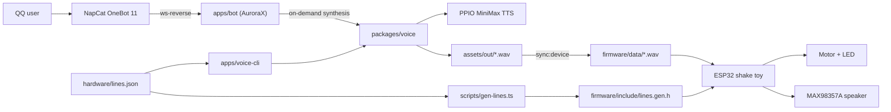

# TaffyBot

A monorepo with two independent products that share a persona and its voice assets:

- a QQ bot that answers with real-time synthesized voice, built on [AuroraX](https://homearchbishop.github.io/aurorax/) and NapCat;
- an ESP32 shake toy that plays pre-generated voice lines offline from an SD card.

## Architecture



The bot and the device never share runtime code. They share the TTS client, the persona presets and
the line manifest, nothing else.

## Layout

| Path             | Responsibility                                                      |
| ---------------- | ------------------------------------------------------------------- |
| `apps/bot`       | AuroraX service connected to NapCat, replies with synthesized voice |
| `apps/voice-cli` | Generates WAV assets for the bot and for the device                 |
| `packages/voice` | TTS client, WAV helpers, persona presets, line manifest loader      |
| `firmware`       | ESP32 firmware: trigger, WAV playback, motor and LED effects        |
| `hardware`       | BOM, wiring, power plan, line manifest                              |
| `scripts`        | Line header generation and device asset sync                        |

## Requirements

- Bun 1.1 or newer
- Node 18 or newer (the bot runs on Bun, Node is only a fallback runtime)
- PlatformIO Core for firmware builds
- A running NapCat instance exposing a reverse WebSocket endpoint

## Quickstart

```bash
bun install
cp .env.example .env        # fill PPINFRA_API_TOKEN and ONEBOT_WS_URL
```

Voice assets:

```bash
bun run tts -- "你好呀"                  # single clip into assets/out
bun run tts:batch                        # one clip per line in hardware/lines.json
```

QQ bot:

```bash
bun run bot:dev
```

Device assets and firmware:

```bash
bun run gen:lines
bun run sync:device                      # copy assets/out/*.wav to firmware/data
cd firmware && pio run -t upload
```

## Checks

```bash
bun run check       # lint, format check, spell, typecheck
bun run lint:fix
bun run format
```

## Conventions

Local working agreements live in `AGENTS.md`, which is gitignored on purpose.

- Comments are English only, module-level, no narration.
- Commits follow monorepo conventional commits: `type(scope): subject`, short and imperative,
  scopes `root`, `bot`, `voice`, `voice-cli`, `firmware`, `hardware`.
- Stage in chunks: one logical change per commit, never `git add .`.
- No co-author trailers, no generated-by footers.

Example commits:

```bash
git add apps/bot/src/middleware && git commit -m "feat(bot): add voice reply middleware"
git add hardware && git commit -m "docs(hardware): add bom and wiring drafts"
```

## Generated artifacts

Never committed: `assets/out/`, `firmware/data/`, `dist/`, `firmware/.pio/`.
`firmware/include/lines.gen.h` is generated by `bun run gen:lines` and committed so firmware builds
work without the TypeScript toolchain.
