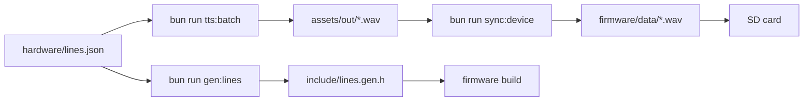

# TaffyBot Firmware

ESP32 shake toy. A trigger plays a pre-generated voice line from the SD card while the motor and
LED react. The device never talks to the bot service: it only consumes assets.

## Pipeline



## Audio contract

- PCM16, 16 kHz, mono WAV. Anything else is rejected at runtime.
- One file per line key, stored at the SD card root, for example `/power_on.wav`.
- The `data` chunk is streamed straight into I2S; no decoder library is linked.

## Layout

| File                   | Responsibility                             |
| ---------------------- | ------------------------------------------ |
| `src/main.cpp`         | Boot, trigger loop, line selection         |
| `src/audio_player.cpp` | WAV header parsing and I2S playback        |
| `src/motion.cpp`       | Motor pulse                                |
| `src/trigger.cpp`      | Debounced button and shake sensor          |
| `src/effects.cpp`      | WS2812 output and idle breathing           |
| `include/pins.h`       | Single source of truth for pin numbers     |
| `include/lines.gen.h`  | Generated line table, never edited by hand |

## Build

```bash
bun run gen:lines      # refresh include/lines.gen.h
bun run tts:batch      # refresh assets/out/*.wav
bun run sync:device    # copy assets to firmware/data
pio run                # compile
pio run -t upload      # flash
```

Copy `firmware/data/*.wav` to the SD card root before powering the toy.
