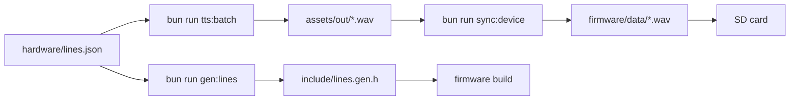

# TaffyBot Firmware

ESP32 switch flipper. A wake word arrives from the SU-03T module over UART, the servo arm presses
the rocker switch, and a pre-generated voice line plays through the I2S amplifier. The device never
talks to the bot service: it only consumes assets.



## Audio contract

- PCM16, 16 kHz, mono WAV. Anything else is rejected at runtime.
- One file per line key, stored at the SD card root, for example `/light_off.wav`.
- The `data` chunk is streamed straight into I2S; no decoder library is linked.

## Layout

| File                   | Responsibility                             |
| ---------------------- | ------------------------------------------ |
| `src/main.cpp`         | Boot, command loop, line lookup            |
| `src/voice.cpp`        | SU-03T command bytes on UART2              |
| `src/flipper.cpp`      | Servo angles that press the rocker         |
| `src/audio_player.cpp` | WAV header parsing and I2S playback        |
| `src/effects.cpp`      | WS2812 status LED                          |
| `include/pins.h`       | Single source of truth for pin numbers     |
| `include/lines.gen.h`  | Generated line table, never edited by hand |

## Calibration

Three servo angles in `src/flipper.cpp` must be tuned with the arm attached and the device powered
but not yet mounted:

| Constant          | Start value | Meaning                    |
| ----------------- | ----------- | -------------------------- |
| `kAngleNeutral`   | 90          | Parked clear of the rocker |
| `kAnglePressUp`   | 35          | Turns the light on         |
| `kAnglePressDown` | 145         | Turns the light off        |

Watch the serial log while tuning. A buzzing servo that does not move is stalled against the
switch: back the angle off by 5 degrees.

## Build

```bash
bun run gen:lines      # refresh include/lines.gen.h
bun run tts:batch      # refresh assets/out/*.wav
bun run sync:device    # copy assets to firmware/data
pio run                # compile
pio run -t upload      # flash
```

Copy `firmware/data/*.wav` to the SD card root before powering the device.
