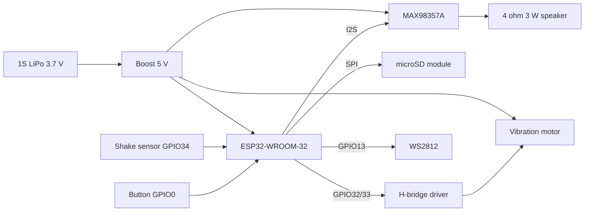

# Taffy Shake Toy Hardware

Offline shake toy: ESP32 reads WAV files from an SD card, drives a vibration motor and a status
LED, and plays the line through an I2S amplifier. No network is required at runtime.

## Block diagram

## Power plan

| Rail       | Source             | Consumers                                       |
| ---------- | ------------------ | ----------------------------------------------- |
| VBAT 3.7 V | 1S LiPo 1200 mAh   | boost input                                     |
| 5 V        | MT3608 boost       | ESP32 `VIN`, MAX98357A `VIN`, motor driver `VM` |
| 3.3 V      | ESP32 on-board LDO | SD module, WS2812, sensor pull-ups              |

Budget: amplifier peaks around 700 mA, the motor adds roughly 150 mA, the ESP32 with WiFi off stays
near 80 mA. A 2 A boost module leaves enough headroom for simultaneous audio and motor activity.

## Inputs

- Button on `GPIO0`: press to play the next line in the table.
- Shake sensor on `GPIO34`: level triggered, debounced in firmware. An SW-420 module works as is;
  a raw ball switch needs an external 10 kOhm pull-down because `GPIO34` has no internal pull-up.

## Files

| File         | Content                                          |
| ------------ | ------------------------------------------------ |
| `bom.md`     | Bill of materials                                |
| `wiring.md`  | Pin-by-pin wiring table                          |
| `lines.json` | Trigger lines: key, text, preset, motor duration |

## Line manifest

`lines.json` is the single source of truth for the offline lines. Both `bun run gen:lines` and
`bun run tts:batch` read it, so the firmware table and the audio files can never drift apart.

| Field        | Required | Meaning                                                    |
| ------------ | -------- | ---------------------------------------------------------- |
| `key`        | yes      | snake_case identifier, also the WAV file name              |
| `text`       | yes      | Chinese line spoken by the device                          |
| `comment`    | no       | Free-form note for humans, never rendered                  |
| `preset`     | no       | Persona preset: `cheerful`, `gentle`, `excited`, `sulky`   |
| `emotion`    | no       | Overrides the emotion of the preset                        |
| `speed`      | no       | Overrides the speed of the preset                          |
| `pitch`      | no       | Overrides the pitch of the preset                          |
| `spinMs`     | no       | Motor pulse length, default 400, max 5000                  |
| `cooldownMs` | no       | Minimum delay between two triggers, default 800, max 10000 |

Generated from this file: `firmware/include/lines.gen.h` and `assets/out/<key>.wav`.
