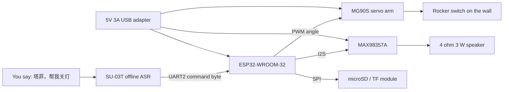

# Taffy Switch Flipper Hardware

A wall-mounted arm that flips a rocker light switch when spoken to, then answers with a voice line.
Everything is soldered-free: modules plug into a breadboard, wires screw into terminal blocks.

## The switch

A standard 86-type rocker panel (86 mm square) that toggles by pressing the top or bottom half.
The servo arm presses one side, then parks back at neutral so the switch stays usable by hand.

Switch state is unknown to the firmware: it can only flip, not force a known state. Adding a light
sensor would close that gap, at the cost of one more module.

## Servo geometry

Calibrate on the bench before mounting anything on the wall.

| Angle             | Value | Meaning                                      |
| ----------------- | ----- | -------------------------------------------- |
| `kAngleNeutral`   | 90    | Arm parked clear of the rocker               |
| `kAnglePressUp`   | 35    | Presses the top half, turns the light on     |
| `kAnglePressDown` | 145   | Presses the bottom half, turns the light off |

Values live in `firmware/src/flipper.cpp`. Adjust until the arm reaches the rocker without stalling
against it. A stalled servo draws several hundred milliamps and buzzes loudly.

## Mounting

No bracket is provided; the arm has to be held against the panel. Options, best first:

1. A printed clamp that clips around the 86 panel frame, printed by a local 3D printing service.
2. A servo bracket plus 3M VHB tape on the panel face. Fast, but the servo can peel off over time.
3. A small plywood or acrylic plate taped over the panel, with the servo screwed to the plate.

Whatever you pick, the servo horn axis must sit parallel to the panel and roughly 15 to 20 mm from
the rocker edge, so the horn sweeps across the switch instead of pressing into the wall.

## Power

| Rail  | Source                   | Consumers                                |
| ----- | ------------------------ | ---------------------------------------- |
| 5 V   | USB adapter, 3 A minimum | ESP32 `VIN`, servo `V+`, MAX98357A `VIN` |
| 3.3 V | ESP32 on-board LDO       | SU-03T logic, WS2812                     |

A 1 A adapter is not enough: the servo inrush alone reaches roughly 700 mA and the ESP32 browns out
and reboots. Run the servo power through the breadboard rail, never from the ESP32 `3V3` pin.

## Keep the microphone away from the speaker

The SU-03T microphone will re-trigger on its own playback if the speaker sits next to it. Keep at
least 10 cm of separation, or put foam between them.

## Wake word

Two syllables are hard for an offline module. Configure the wake word as three or four syllables,
for example `你好塔菲` or `塔菲塔菲`, then add `帮我关灯` and `帮我开灯` as commands.

## Files

| File         | Content                        |
| ------------ | ------------------------------ |
| `bom.md`     | Bill of materials              |
| `wiring.md`  | Pin-by-pin wiring table        |
| `lines.json` | Voice lines: key, text, preset |

## Line manifest

`lines.json` is the single source of truth for the spoken lines. Both `bun run gen:lines` and
`bun run tts:batch` read it, so the firmware table and the audio files cannot drift apart.

| Field     | Required | Meaning                                                  |
| --------- | -------- | -------------------------------------------------------- |
| `key`     | yes      | snake_case identifier, also the WAV file name            |
| `text`    | yes      | Chinese line played by the device                        |
| `comment` | no       | Note for humans, never rendered                          |
| `preset`  | no       | Persona preset: `cheerful`, `gentle`, `excited`, `sulky` |
| `emotion` | no       | Overrides the preset emotion                             |
| `speed`   | no       | Overrides the preset speed                               |
| `pitch`   | no       | Overrides the preset pitch                               |

Generated from this file: `firmware/include/lines.gen.h` and `assets/out/<key>.wav`.
